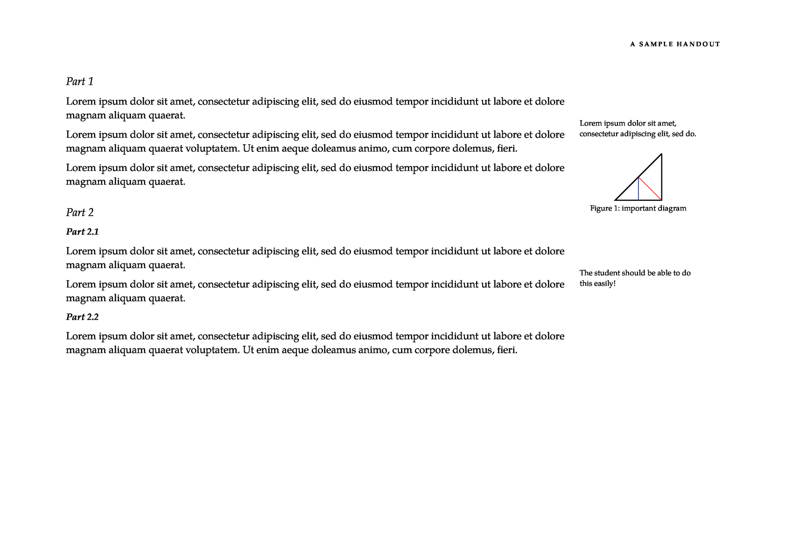

Provides a template for Tufte-style handouts modeled on the [Tufte-LaTeX](https://github.com/Tufte-LaTeX/tufte-latex) project.
The key feature of this template is the `margin_note` function whichs renders content in the left margin area.

## Preview
### Portrait


### Landscape


## Usage
* No images or other assets required, just grab the `tufte-handout.typ` file
* The template will attempt to use the "TeX Gyre Pagella" font if installed but the default font looks pretty good as well.

```typst
#import "handout.typ": tufte_handout, margin_note
#show: doc => tufte_handout(title: "A sample handout", doc)

= Part 1

#lorem(20)
#margin_note[A note!]
#lorem(30)
#margin_note[#lorem(20)]
#lorem(20)
```
